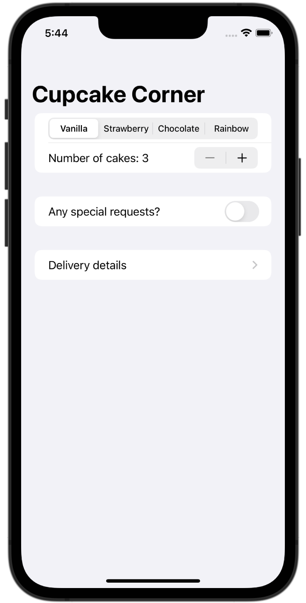
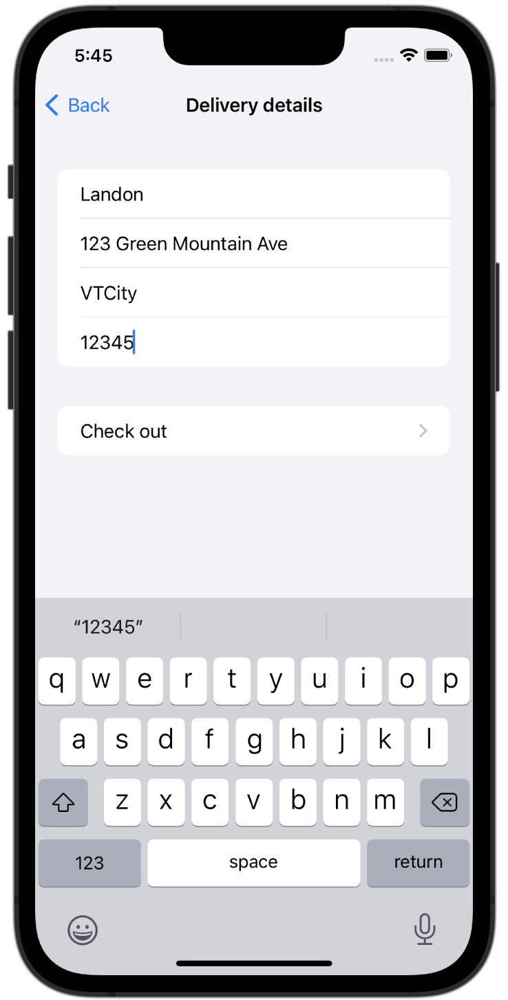
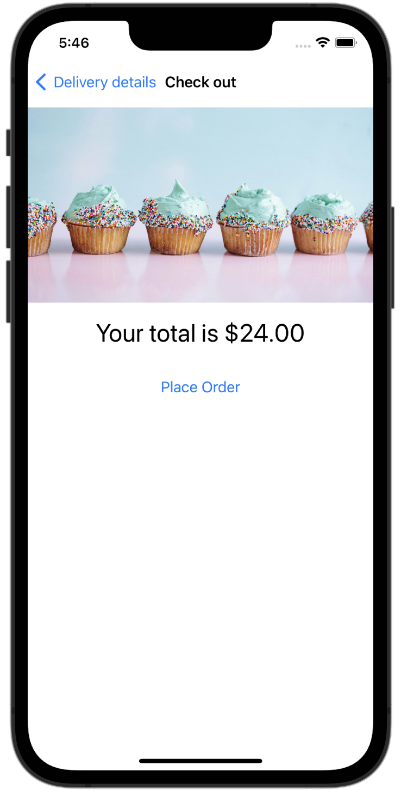
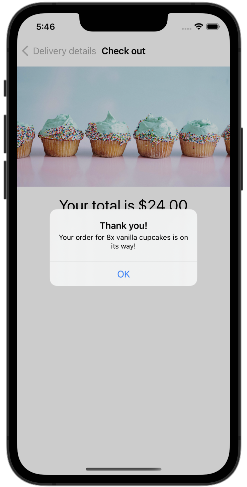

# CupcakeCorner

A basic iOS app used to order cupcakes from a fictional service. With the app, people will be able to select how many cupcakes they want, select which type they want, and set special options.

## Installing / Getting started

To run this project, you will need a Mac computer with the latest version of Xcode and an iOS 15 Simulator set up. Simply clone the respository, open the project in Xcode, and run the app to get it working. 

## Features

* Select a flavor, quantity, and special request options for a fictional cupcake order
* Fill out form with address info
* Confirm final order amount, then place it

## Credit

The idea for this project came from Paul Hudson's *100 Days of SwiftUI*. I may eventually add to this code, but credit for the base code goes to Paul Hudson. Links to each day on which material is referenced may be found below:

[Day 49 - CupcakeCorner Part One](https://www.hackingwithswift.com/100/swiftui/49)

[Day 50 - CupcakeCorner Part Two](https://www.hackingwithswift.com/100/swiftui/50)

[Day 51 - CupcakeCorner Part Three](https://www.hackingwithswift.com/100/swiftui/51)

[Day 52 - CupcakeCorner Part Four](https://www.hackingwithswift.com/100/swiftui/52)

## Screenshots

Screenshots will go here when they are ready.

    
    
    
    

